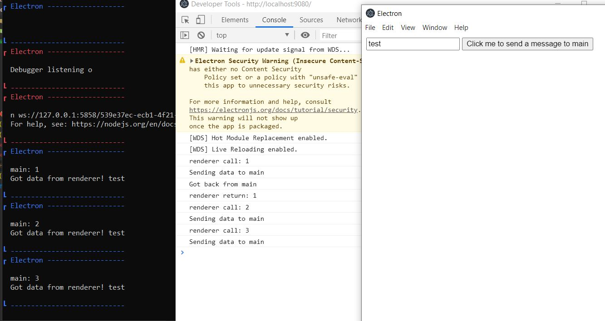

# electron-better-ipc callMain bug repro
## Repro steps
1. `git clone`
2. `npm install`
3. `npm run dev`
4. In the opened electron window - enter something in the input and click the button two or more times. See devtools and console opened in step 3 for logs.

As can be seen in the image, returned promise resolves only after the first call to the `callMain` method.
